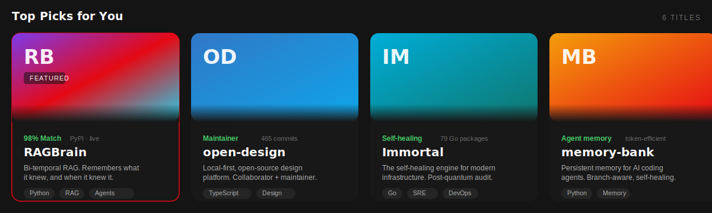
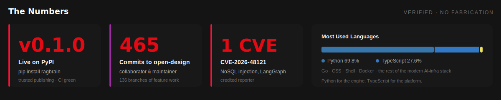

**[▶ Play the interactive demo](https://nagendhra-madishetti.github.io/ragbrain/replay.html)** &nbsp;·&nbsp; **[+ pip install ragbrain](https://pypi.org/project/ragbrain/)** &nbsp;·&nbsp; **[ℹ More info](#-behind-the-scenes)**

---

## 🔴 THE BILLBOARD

<table>
<tr>
<td width="54%" valign="top">

### RAGBrain
#### *RAG with a brain.*

Every AI agent today forgets you the moment the session ends. Worse, when a fact changes, most systems quietly overwrite the past as if the old belief never existed.

**RAGBrain remembers what it knew, and when it knew it.** Every fact lives on two independent time axes. Corrections supersede instead of overwrite. And you can replay the system's beliefs at any past moment without later knowledge leaking backward - an invariant enforced in CI against a live graph database.

`100%` on as-of questions where vector RAG scores `0%`. Measured on a fictional corpus so no model can answer from training, content-hashed, with a reproduce command.

</td>
<td width="46%" valign="top">

<b>Drag the slider through 2022.</b> The system un-knows the correction and answers as it believed then.

</td>
</tr>
</table>

## 📺 TOP PICKS FOR YOU

[**RAGBrain**](https://github.com/Nagendhra-Madishetti/ragbrain) &nbsp;·&nbsp; [**open-design**](https://github.com/Nagendhra-Madishetti/open-design) &nbsp;·&nbsp; [**Immortal**](https://github.com/Nagendhra-Madishetti/Immortal) &nbsp;·&nbsp; [**memory-bank**](https://github.com/Nagendhra-Madishetti/memory-bank) &nbsp;·&nbsp; [**mlflow**](https://github.com/Nagendhra-Madishetti/mlflow) &nbsp;·&nbsp; [**pulseops**](https://github.com/Nagendhra-Madishetti/pulseops)

## 📊 THE NUMBERS

## 🎬 CONTINUE WATCHING

| | Episode | Status |
|:--:|---|---|
| ✅ | **S1E1 · Build the substrate** - bi-temporal core, FalkorDB and Neo4j backends, un-knowing invariant enforced in CI | `██████████` shipped |
| ✅ | **S1E2 · Ship it** - RAGBrain v0.1.0 live on PyPI via trusted publishing, 164 tests green | `██████████` shipped |
| ▶️ | **S1E3 · The launch** - benchmark story, interactive replay, community launch | `███████░░░` in progress |
| 🔜 | **S2 · Learned memory** - fine-tuned extraction, consolidation and forgetting; online evaluation at scale | `██░░░░░░░░` next |

## 🍿 MY LIST · the modern AI infra stack

`RAG pipelines` &nbsp;`temporal knowledge graphs` &nbsp;`agent memory` &nbsp;`vector search` &nbsp;`rerankers`
`LLM orchestration` &nbsp;`evaluation at scale` &nbsp;`self-hosted inference` &nbsp;`MCP` &nbsp;`observability`

## 🏆 CRITICS' ACCLAIM

> **🛡️ CVE-2026-48121** — Found and responsibly reported a NoSQL parameter injection in LangGraph's MongoDB checkpointer that allowed **cross-tenant memory access**: one agent's memory readable from another tenant's session. Fixed by the maintainers, credited reporter on [`langchain-ai/langgraphjs`](https://github.com/advisories/GHSA-98xf-r82g-9mhx).

> **🎨 Open Design — collaborator & maintainer** — 465 commits across 136 working branches on [`nexu-io/open-design`](https://github.com/nexu-io/open-design): the critique-theater pipeline, e2e automation suites, and preview infrastructure for a local-first design platform with 400+ contributors.

> **🧠 RAGBrain** — The only system in its benchmark that answers *"what did we believe last March, before the correction?"* and proves it with citations, validity windows, and a full audit timeline.

> **🎓 MS in Computer Science** — University at Albany, SUNY.

## 📼 PREVIOUSLY ON @Nagendhra-web

My earlier account earned its badges the hard way before I retired it:

`🤠 Quickdraw` &nbsp; `🦈 Pull Shark ×2` &nbsp; `👥 Pair Extraordinaire` &nbsp; `🌟 Starstruck`

## 🎞️ BEHIND THE SCENES

<b>🧠 Why bi-temporal memory - the idea behind RAGBrain</b>

 

Ask any RAG system *"where is Acme headquartered?"* and it answers fine. Ask *"where was it headquartered in 2020?"* and vector RAG fails. Ask *"what did we believe in 2021, before the 2022 correction arrived?"* and **everything** fails - except a bi-temporal ledger.

RAGBrain stamps every fact with two independent time axes:

| Axis | Question it answers |
|---|---|
| **Event time** `[valid_at, invalid_at)` | when it was true in the world - *"as of 2020"* |
| **System time** `[created_at, expired_at)` | when the system learned it - *"what did we believe on March 3rd"* |

A correction expires the old fact and stamps what superseded it. Nothing is silently overwritten, so every answer carries citations, validity windows, and honesty labels that distinguish an asserted date from a derived one. Replaying to a past moment drops everything learned after it - including the knowledge that a fact was later corrected.

**[▶ Try the interactive replay](https://nagendhra-madishetti.github.io/ragbrain/replay.html)** &nbsp;·&nbsp; `pip install ragbrain`

<b>🛡️ Breaking memory systems to make them safer - the CVE</b>

 

While building memory infrastructure I audit it too. In LangGraph's MongoDB checkpointer I found a NoSQL parameter injection through the metadata filter path: crafted keys escaped their intended scope, making **one tenant's agent memory readable from another tenant's session**.

Memory layers hold the most sensitive data an agent has - conversations, preferences, internal context. They deserve adversarial attention, not just feature work. Reported privately, fixed by the maintainers, published as **CVE-2026-48121** with reporter credit.

<b>🏗️ How RAGBrain is built</b>

 

- **Dependency-free core.** `ragbrain.core` imports only the standard library. Storage, models, and retrieval are adapters behind stable interfaces.
- **Swappable backends.** Graphiti on FalkorDB or Neo4j - same test suite, no special-casing in core.
- **Every plug fails loud.** A missing key raises; nothing silently degrades to a worse embedder and pretends it worked.
- **Probabilistic tier is fenced off.** LLM falsification and faithfulness judging are advisory only, never mutating the deterministic ledger.
- **Proven at scale.** Redis-backed shared state across replicas, rate limits, metrics endpoint, two-replica proof script.
- **Honest evaluation.** Bounds are set *from* measurement, never moved to make a test pass.

<b>🎨 The Open Design work</b>

 

[Open Design](https://github.com/nexu-io/open-design) is a local-first, open-source design platform - 19 skills, 71 brand-grade design systems, generating web, desktop and mobile prototypes. I contribute as a collaborator and maintainer with 465 commits across 136 branches, working on the critique-theater pipeline, end-to-end automation suites, and preview infrastructure.

## 📬 GET IN TOUCH

**Building something in agent memory, RAG, or AI infrastructure? I want to hear about it.**

 

**Are you still watching?** &nbsp;·&nbsp; New York, NY &nbsp;·&nbsp; he/him

