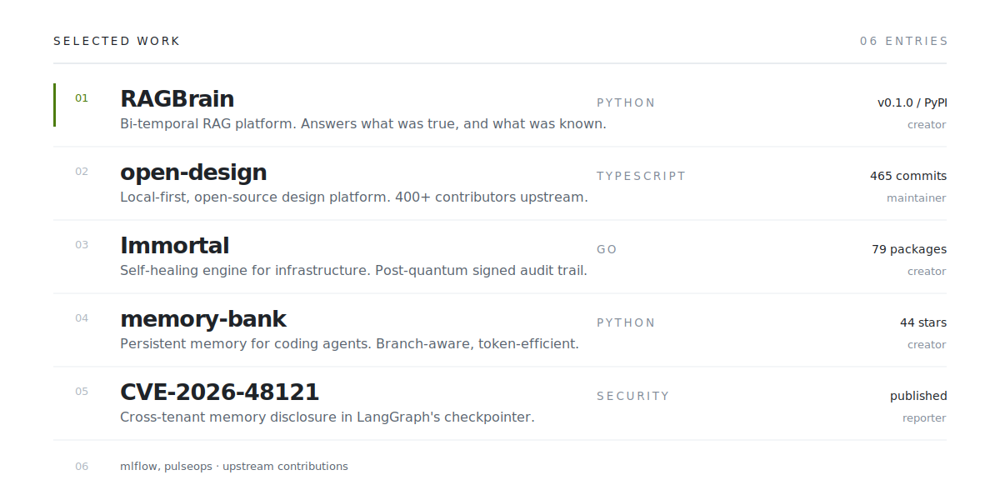
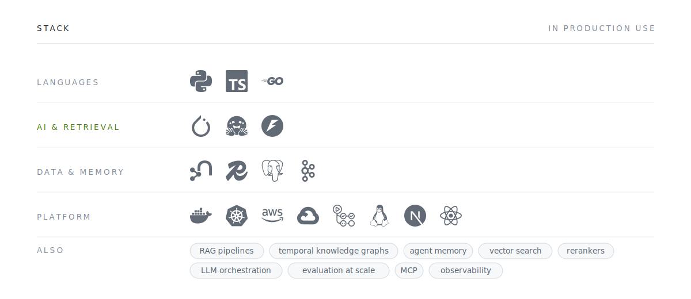

<picture>
  <source media="(prefers-color-scheme: dark)" srcset="assets/hero-dark.svg">
  
</picture>

**[Interactive demo](https://nagendhra-madishetti.github.io/ragbrain/replay.html)**
&nbsp;·&nbsp;
**[RAGBrain](https://github.com/Nagendhra-Madishetti/ragbrain)**
&nbsp;·&nbsp;
**[LinkedIn](https://www.linkedin.com/in/nagendhramadishetti/)**
&nbsp;·&nbsp;
**[Email](mailto:nagendhra.madishetti24@gmail.com)**

 

I build memory infrastructure for AI agents: retrieval systems that hold context across time, know when their own knowledge changed, and can prove what they believed at any past moment. Most retrieval systems answer *what is true now*. Mine also answers *what did we believe then*, which is the difference between a plausible answer and a defensible one.

Currently building **[RAGBrain](https://github.com/Nagendhra-Madishetti/ragbrain)**, an open-source bi-temporal RAG platform, live on PyPI. Maintainer on **[open-design](https://github.com/nexu-io/open-design)**. Reporter behind **CVE-2026-48121** in LangGraph's memory layer.

 

## Selected work

<picture>
  <source media="(prefers-color-scheme: dark)" srcset="assets/work-dark.svg">
  
</picture>

 

## The invariant

<picture>
  <source media="(prefers-color-scheme: dark)" srcset="assets/timeline-dark.svg">
  
</picture>

Every fact carries two independent time axes: **event time**, when it was true in the world, and **system time**, when the system learned it. A correction expires the old fact and stamps what superseded it, so nothing is ever silently overwritten.

Replaying to a past moment therefore drops everything learned after it, including the knowledge that a fact was later corrected. That is the un-knowing invariant, and it is enforced in CI against a live graph database on every commit.

**[Drag the slider yourself](https://nagendhra-madishetti.github.io/ragbrain/replay.html)**

 

## Stack

<picture>
  <source media="(prefers-color-scheme: dark)" srcset="assets/stack-dark.svg">
  
</picture>

 

## Notes

<b>Why bi-temporal memory</b>

 

Ask any RAG system *"where is Acme headquartered?"* and it answers fine. Ask *"where was it headquartered in 2020?"* and vector RAG fails. Ask *"what did we believe in 2021, before the 2022 correction arrived?"* and everything fails, except a bi-temporal ledger.

| Axis | Interval | Answers |
|---|---|---|
| Event time | `[valid_at, invalid_at)` | what was true in the world, as of any date |
| System time | `[created_at, expired_at)` | what the system knew, as of any date |

The second axis is what makes an answer auditable rather than merely plausible. Every served fact carries citations, a validity window, and an honesty label distinguishing an asserted date from a derived one, so a guessed timestamp is never laundered into a certainty.

<b>Breaking memory systems to make them safer</b>

 

While building memory infrastructure I audit it too. In LangGraph's MongoDB checkpointer I found a NoSQL parameter injection through the metadata filter path: crafted keys escaped their intended scope, making one tenant's agent memory readable from another tenant's session.

Memory layers hold the most sensitive data an agent has. They deserve adversarial attention, not just feature work. Reported privately, fixed by the maintainers, published as **CVE-2026-48121** with reporter credit.

<b>How RAGBrain is built</b>

 

- **Dependency-free core.** `ragbrain.core` imports only the standard library. Storage, models and retrieval are adapters behind stable interfaces.
- **Swappable backends.** Graphiti on FalkorDB or Neo4j, same test suite, no special-casing in core.
- **Every plug fails loud.** A missing key raises. Nothing silently degrades to a weaker embedder and pretends it worked.
- **The probabilistic tier is fenced off.** LLM falsification and faithfulness checking are advisory, never mutating the deterministic ledger.
- **Multi-replica ready.** Shared session state, durable write-back journal, rate limits, metrics endpoint, two-replica proof.
- **Honest evaluation.** Published bounds are derived from measurement and never widened to make a test pass. 164 tests green in CI.

<b>Open Design</b>

 

[Open Design](https://github.com/nexu-io/open-design) is a local-first, open-source design platform with 19 skills and 71 brand-grade design systems, generating web, desktop and mobile prototypes. I contribute as a collaborator and maintainer across 465 commits and 136 branches, working on the critique-theater pipeline, end-to-end automation suites, and preview infrastructure.

<b>Previously, as @Nagendhra-web</b>

 

My earlier account, now retired, earned its badges the hard way: `Quickdraw` · `Pull Shark ×2` · `Pair Extraordinaire` · `Starstruck`. The work moved here; the commits kept their dates.

 

---

Building something in agent memory, RAG, or AI infrastructure? I would like to hear about it.

  

&nbsp;

&nbsp;

 

New York, NY &nbsp;·&nbsp; he/him

